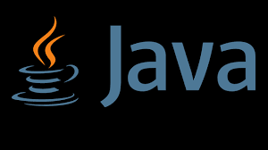

# Savio-Feng-Java-Notes
**You can find in this repository, all my notes about Java.**

## Introduction of Java
Java is a general-purpose, object-oriented programming language that is designed to be portable, efficient, and secure. Java code is compiled to bytecode, which can run on any platform that supports the Java Virtual Machine (JVM). Java has a rich set of libraries and tools that enable developers to create applications for various domains, such as web, mobile, desktop, embedded, and cloud. Java is also a popular choice for enterprise software development, as it supports features such as concurrency, modularity, generics, lambda expressions, and streams. Java follows the principle of “write once, run anywhere” (WORA), meaning that Java applications can run on different operating systems and hardware architectures without requiring recompilation. Java is one of the most widely used and influential programming languages in the world, with millions of developers and billions of devices running Java.

 
  

#Author
<b>Xiao Li Savio Feng</b>
